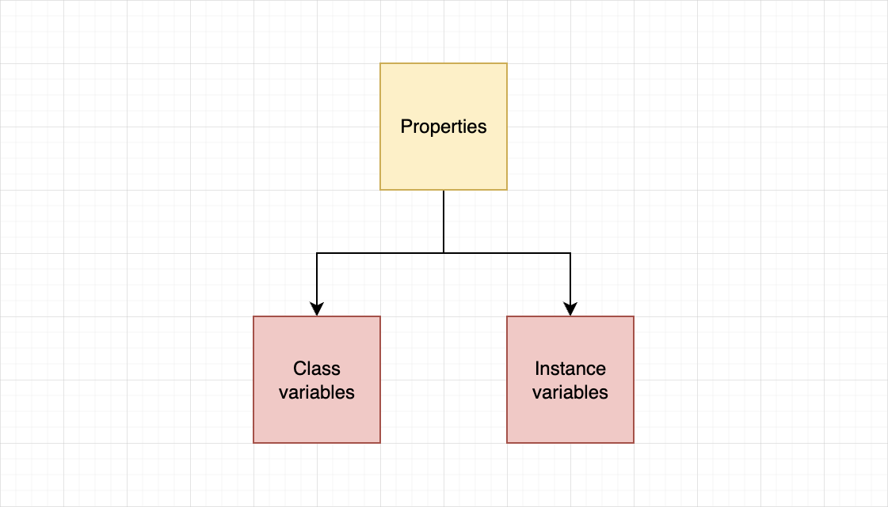
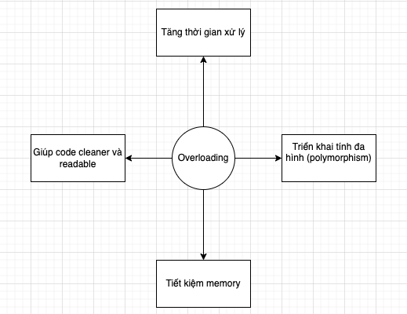

# Initializing Objects
Initializer được dùng để khởi tạo một object của một class. Initializer được gọi tự động khi một object của class được tạo. Đây là một method đặc biệt giúp chúng ta xác định và gán giá trị cho các instance variables.

Dứới đây là ví dụ khi `Employee` class object được tạo.
```Python
class Employee:
    # defining the properties and assigning None to them
    def __init__(self, ID=None, salary=0, department=None):
        self.ID = ID
        self.salary = salary
        self.department = department

# creating an object of the Employee class with default parameters
Steve = Employee()
Mark = Employee("3789", 2500, "Human Resources")

# Printing properties of Steve and Mark
print("Steve")
print("ID :", Steve.ID)
print("Salary :", Steve.salary)
print("Department :", Steve.department)
print("Mark")
print("ID :", Mark.ID)
print("Salary :", Mark.salary)
print("Department :", Mark.department)
```

**Output**
```
Steve
ID : None
Salary : 0
Department : None
Mark
ID : 3789
Salary : 2500
Department : Human Resources
```
# Class và Instance Variables
Trong Python, properties được chia làm 2 loại:
- Class variables
- Instance variables



## Class variables
Tất cả các objects của class đều được phép truy cập và thay đổi giá trị của **class variable**. Khi thay đổi giá trị của **class variable** thì giá trị của property này sẽ thay đổi trong tất cả các object của class.

## Instance variables
**Instance variables** là của riêng với mỗi objects. Sự thay đổi ở instance variables của object nào thì chỉ ảnh hưởng đến object đó.

## Khai báo class variable và instance variable
**Class variables** được khai báo ngoài `initializer` và **instance variables** được khai báo trong scope của `initializer`

```python
class Player:
    teamName = 'Manchester City'  # class variables

    def __init__(self, name):
        self.name = name  # creating instance variables
```

## Ví dụ về sử dụng class variable `sai`
Chúng ta phải sử dụng **class variable** đúng cách vì như đã nói, chúng a được chia sẻ cho tất cả các objects thuộc class và có thể thay đổi giá trị của **class variable** bằng cách sử dụng bất kỳ objects nào.

```python
class Player:
    teamName = 'Manchester City'  # class variables
    formerTeams = [] # class variables
    def __init__(self, name):
        self.name = name  # creating instance variables

p1 = Player("David Silva")
p2 = Player("Yaya Toure")

p1.formerTeams.append('Celta Vigo') # wrong use of class variable
p2.formerTeams.append('Barcelona') # wrong use of class variable

print("Name:", p1.name)
print("Team Name:", p1.teamName)
print(p1.formerTeams)
print("Name:", p2.name)
print("Team Name:", p2.teamName)
print(p2.formerTeams)
```
**Output**
```
Name: David Silva
Team Name: Manchester City
['Celta Vigo', 'Barcelona']
Name: Yaya Toure
Team Name: Manchester City
['Celta Vigo', 'Barcelona']
```

Ở ví dụ trên, trong khi **instance variable** `name` là riêng biệt cho mỗi object thuộc `Player` class. Thì **class variable** `formerTeams`, có thể truy cập bởi tất cả các object thuộc class nên nó đã được cập nhật giá trị. 

Chúng ta đang lưu trữ tất cả các cầu thủ hiện đang chơi cho cùng một đội, nhưng mỗi cầu thủ trong đội phần lớn sẽ không cùng đội bóng cũ. Để tránh vấn đề này, triển khai chính xác cho ví dụ trên sẽ như sau:

```python
class Player:
    teamName = 'Manchester City'  # class variables
    
    def __init__(self, name):
        self.name = name  # instance variables
        self.formerTeams = [] # instance variables

p1 = Player("David Silva")
p2 = Player("Yaya Toure")

p1.formerTeams.append('Celta Vigo') # wrong use of class variable
p2.formerTeams.append('Barcelona') # wrong use of class variable

print("Name:", p1.name)
print("Team Name:", p1.teamName)
print(p1.formerTeams)
print("Name:", p2.name)
print("Team Name:", p2.teamName)
print(p2.formerTeams)
```
**Output**
```
Name: David Silva
Team Name: Manchester City
['Celta Vigo']
Name: Yaya Toure
Team Name: Manchester City
['Barcelona']
```
Bây giờ, `formerTeams` đã là của riêng của mỗi `Player` object, và sẽ được truy cập bởi object đó mà thôi.

## Một ví dụ khác về sử dụng class variables
```python
class Player:
    teamName = 'Manchester City'      # class variables
    teamMembers = []

    def __init__(self, name):
        self.name = name        # creating instance variables
        self.formerTeams = []
        self.teamMembers.append(self.name)


p1 = Player('David Silva')
p2 = Player('Yaya Toure')

print("Team Name:", p1.teamName)
print("Team Members:")
print(p1.teamMembers)
print("")
print("Name:", p2.name)
print("Team Members:")
print(p2.teamMembers)
```

**Output**
```
Team Name: Manchester City
Team Members:
['David Silva', 'Yaya Toure']

Name: Yaya Toure
Team Members:
['David Silva', 'Yaya Toure']
```
Ở ví dụ trên, chúng ta đã khai báo `teamMembers`, một list được chia sẻ với tất cả các object thuộc `Player` class. Mỗi object `Player` được tạo ra, `name` của object sẽ được thêm vào list `teamMembers`, chúng ta có thể thấy `p1` và `p2` đều có thể truy cập vào `teamMembers`.

# Methods trong một Class
Trong phần này, chúng ta sẽ xem về chuyện tương tác giữa ``properties`` và các ``objects``. Đây là lúc ``methods`` xuất hiện, có 3 loại `method` trong Python:
1. **instance methods**
2. **class methods**
3. **static methods**

> `Note`: Chúng ta sẽ gọi **method** cho **instance method** vì nó thường được sử dụng nhất.

## Instance Method

> **`Methods`** là một nhóm các statements (câu lệnh) thực hiện một số thao tác (operations) và có thể trả về (return) hoặc không trả về một kết quả.

### self
Chúng ta có một class `Employee`
```python
class Employee:
    def __init__(self, ID=None, department=None):
        self.ID = ID
        self.department = department
```
Khi chúng ta tạo object employee1
```python
employee1 = Employee("Puraudorin", "FAA")
```
Thì Python sẽ convert giúp chúng ta thành:
```Python
Employee.__init__(employee1, "Puraudorin", "FAA")
```
Và bên trong ``initializer`` sẽ thực thi như sau:
```
employee1.ID = "Puraudorin"
employee1.department = "FAA"
```


## Method overloading
> Overloading đề cập đến việc làm cho một method thực hiện các operations khác nhau dựa trên các **arguments** của nó.


Không như các ngôn ngữ lập trình khác, methods **không thể** explicitly overloaded ở Python, chỉ có thể implicitly overloaded.




## Ví dụ:
```python
class Employee:
    # defining the properties and assigning them None to the
    def __init__(self, ID=None, salary=None, department=None):
        self.ID = ID
        self.salary = salary
        self.department = department

    # method overloading
    def demo(self, a, b, c, d=5, e=None):
        print("a =", a)
        print("b =", b)
        print("c =", c)
        print("d =", d)
        print("e =", e)
    def demo(self, a, b, c):
        print("a = ", a)
        print("b = ", b)
        print("c = ", c)
        

# cerating an object of the Employee class
Steve = Employee()

# Printing properties of Steve
print("Demo 1")
Steve.demo(1, 2, 3)
print("\n")

print("Demo 2")
Steve.demo(1, 2, 3, 4, 5)

```

**Output**
```
Demo 1
a =  1
b =  2
c =  3


Demo 2

Traceback (most recent call last):
  File "main.py", line 30, in <module>
    Steve.demo(1, 2, 3, 4, 5)
TypeError: demo() takes 4 positional arguments but 6 were given
```

Nhận được `TypeError`, điều này là khi có nhiều method trùng tên, Python sẽ coi method được khai báo cuối cùng là method sẽ được sử dụng khi chúng ta gọi. Ở đây là method `demo` với 4 parameters.

Vậy phải làm sao? Chúng ta có vài cách để thực hiện method overloading trong Python, ở đây chúng ta sẽ dùng **multiple dispatch**

```python
from multipledispatch import dispatch

class Employee:
    # defining the properties and assigning them None to the
    def __init__(self, ID=None, salary=None, department=None):
        self.ID = ID
        self.salary = salary
        self.department = department

    @dispatch(int, int, int, int, int)
    def demo(self, a, b, c, d=5, e=None):
        print("a =", a)
        print("b =", b)
        print("c =", c)
        print("d =", d)
        print("e =", e)
        
    @dispatch(int, int, int)
    def demo(self, a, b, c):
        print("a = ", a)
        print("b = ", b)
        print("c = ", c)
        

# cerating an object of the Employee class
Steve = Employee()

# Printing properties of Steve
print("Demo 1")
Steve.demo(1, 2, 3)
print("\n")

print("Demo 2")
Steve.demo(1, 2, 3, 4, 5)
```
**Output**
```
Demo 1
a =  1
b =  2
c =  3


Demo 2
a = 1
b = 2
c = 3
d = 4
e = 5
```

## Class Method

**Class methods** làm việc với **class variables** và có thể truy cập bằng cách sử dụng `Class name` thay vì object.

> **Class method** được truy cập bằng cách sử dụng tên Class và có thể truy cập mà không cần tạo class object.

### Syntax

Để khai báo một class method, chúng ta sử dụng `@classmethod` decorator. `cls` được sử để refer tới class cũng như chúng ta sử dụng `self` để refer tới object của class. Bạn cũng có thể sử dụng bất cứ tên nào để thay thế `cls`, nhưng vì convention (quy ước), chúng ta sẽ sử dụng `cls`.

> `Note`: Không như `instance methods` (methods), tất cả class methods phải có ít nhất 1 parameter, là `cls`.

## Ví dụ:
```python
class Player:
    teamName = 'Manchester City'  # class variable

    def __init__(self, name):
        self.name = name  # instance variable

    # define getTeamName using @classmethod decorator
    @classmethod
    def getTeamName(cls):
        return cls.teamName


print(Player.getTeamName())
```
**Output**
```
Manchester City
```

> `Note`: `cls` cũng hoạt động tương tự `self` ở methods, khi chúng ta gọi class method bằng object hay class thì `class name` sẽ được ngầm gán cho parameter thứ nhất của **class method** (`cls` sẽ thay bằng `class name`)


## Static methods
Static method là method được dùng chỉ giới hạn ở phạm vi class. Chúng không tương tác với **class variable** hay **instance variable**. Chúng được sử dụng như các *utility functions* bên trong class.

> Static methods có thể được truy cập bằng cách sử dụng class name hoặc object name

### Syntax 
Để khai báo static method, chúng ta sử dụng `@staticmethod` decorator. Vì nó không được sử dụng để tham chiếu đến *object* hay *class* nên chúng ta không sử dụng `self` hay `cls` argument. 

Static methods không biết bất cứ thứ gì về state của class, ví dụ nó không thể chỉnh sửa các thuộc tính của class.
Chúng ta có thể truyền bao nhiêu tham số cũng được vào static method này để thực hiện bất kỳ hàm nào mà không can thiệp vào **instance** hoặc **class variable**. Cứ coi nó như một utility function .

## Ví dụ
```python
class Player:
    teamName = 'Manchester City'  # class variables

    def __init__(self, name):
        self.name = name  # creating instance variables

    @staticmethod
    def demo():
        print("I am a static method.")


p1 = Player('lol')
p1.demo()
Player.demo()
```
**Output**
```
I am a static method.
I am a static method.
```

Giả sử chúng ta có 1 class `BodyInfo` chứa thông tin về cân nặng và chiều cao của một người. Chúng ta có thể tạo một static method để tính BMI cho bất kỳ `cân nặng` và `chiều cao` nào được truyền vào, ví dụ:

```python
class BodyInfo:

    @staticmethod
    def bmi(weight, height):
        return weight / (height**2)

weight = 75
height = 1.8
print(BodyInfo.bmi(weight, height))
```

**Output**
```
23.148148148148145
```

Vì sự đặc biệt của static method, nó được dùng rất hạn chế, khi cần sử dụng utility function mà không cần tham chiếu tới object hay class thì chúng ta có thể tạo ra chúng, việc gọi chúng thông qua `class name` hay `class object` giúp chúng ta hiểu rõ về bối cảnh sử dụng cũng như chức năng của chúng.

# Access Modifiers
Chúng ta cùng tìm hiểu về `private`, `public` and `protected` **attributes** trong Python

## Public attributes
> Public attributes có thể truy cập trong class và ngoài class.

Trong Python, tất cả *methods* và *properties* mặc định là public. Nếu chúng ta muốn chỉ định một method nào đó không nên được truy cập như là `public` method, chúng ta phải khai báo nó là `private`.
### Ví dụ về public attributes
```Python
class Employee:
    def __init__(self, ID, salary):
        # all properties are public
        self.ID = ID
        self.salary = salary

    def displayID(self):
        print("ID:", self.ID)


Steve = Employee(3789, 2500)
Steve.displayID()
print(Steve.salary)
```
**Ouput**
```
ID: 3789
2500
```
Ở phần code trên, properties `ID`, `salary` và method `displayID()` là **public** nên chúng ta có thể truy cập ở trong cũng như ở ngoài class.

## Private attributes
> Private attributes không thể truy cập trực tiếp từ ngoài class, chỉ có thể truy cập ở bên trong class.

Mục đích là để ẩn nó khỏi người dùng và các class khác. Ở Python, chúng ta có thể tạo private attribute bằng cách sử dụng tiền tố (prefix) `__` .

### Private properties
Ví dụ:
```python
class Employee:
    def __init__(self, ID, salary):
        self.ID = ID
        self.__salary = salary  # salary is a private property


Steve = Employee(3789, 2500)
print("ID:", Steve.ID)
print("Salary:", Steve.__salary)  # this will cause an error
```


**Output**
```
ID: 3789


Traceback (most recent call last):
  File "main.py", line 9, in <module>
    print("Salary:", Steve.__salary)  # this will cause an error
AttributeError: 'Employee' object has no attribute '__salary'
```
`ID` là *public* property nhưng `__salary` là *private* property nên không thể truy cập bên ngoài class.

### Private methods
```python
class Employee:
    def __init__(self, ID, salary):
        self.ID = ID
        self.__salary = salary  # salary is a private property

    def displaySalary(self):  # displaySalary is a public method
        print("Salary:", self.__salary)

    def __displayID(self):  # displayID is a private method
        print("ID:", self.ID)


Steve = Employee(3789, 2500)
Steve.displaySalary()
Steve.__displayID()  # this will generate an error
```

**Output**
```
Salary: 2500

Traceback (most recent call last):
  File "main.py", line 15, in <module>
    Steve.__displayID()  # this will generate an error
AttributeError: 'Employee' object has no attribute '__displayID'
```

Tương tự như trên, `__displayID` là *private* method, không thể truy cập được từ bên ngoài class.

> `Note`: Methods thường là public

## Truy cập private attributes trong main code
Nếu cảm thấy thật sự cần thiết truy cập *private* property hoặc method, chúng ta có thể sử dụng `_<ClassName>` prefix để truy cập, ví dụ như:
```python
class Employee:
    def __init__(self, ID, salary):
        self.ID = ID
        self.__salary = salary  # salary is a private property


Steve = Employee(3789, 2500)
print(Steve._Employee__salary)  # accessing a private property
```
**Output**
```
2500
```
